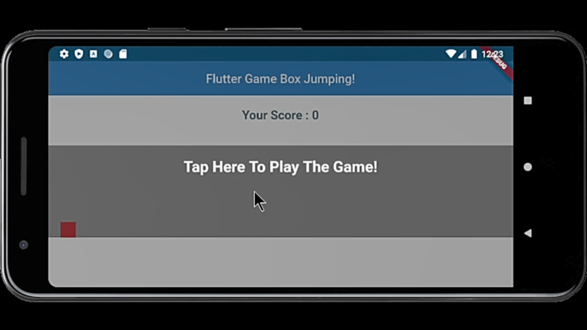
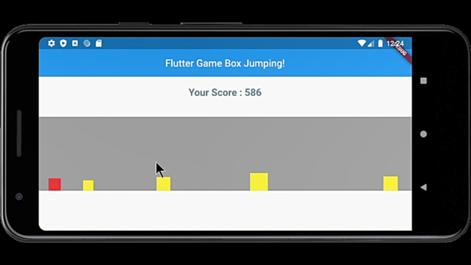
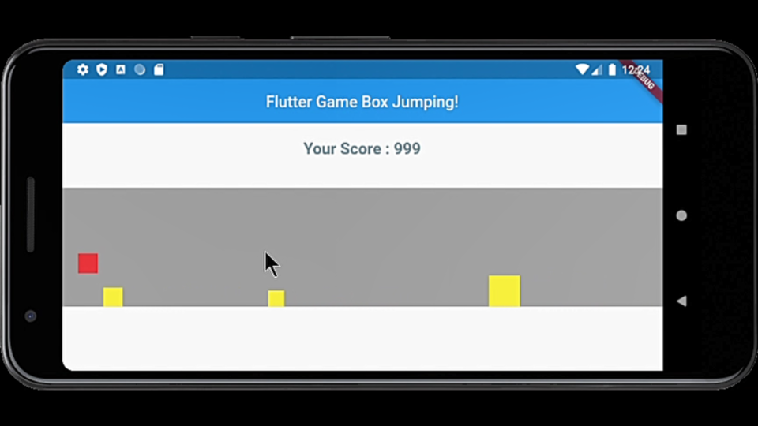

# Flutter Game Box Jumping

  

Just do something fun with Google Flutter Build Mobile Game Application like TREX / Dino on Google Chrome.

### Installing

- git clone https://github.com/bonamoogy/flutter-game-box-jumping-/archive/master.zip
- open your favourite IDE
- flutter packages get
- flutter run

### Snapshots

   
